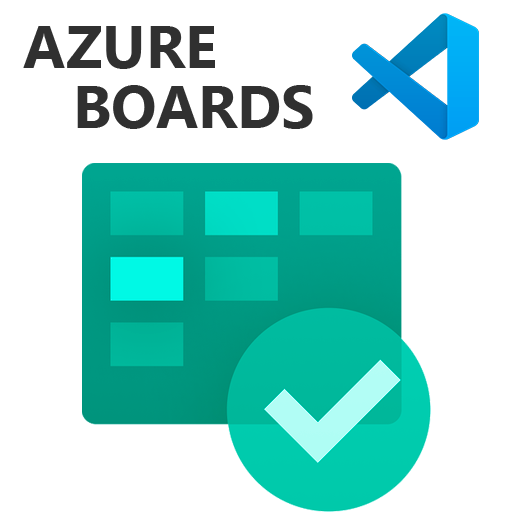
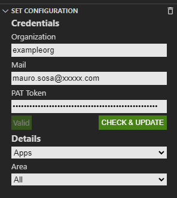

<h1 align="center">Azure Boards</h1>

  
   
  <i>This is a visual studio code extension oriented to get information about azure boards work items.</i>
   

## Usage

### Credentials configuration
1. You must set our credentials on credentials section.\
To get your pat token, follow those instructions: [Use personal access tokens](https://learn.microsoft.com/en-us/azure/devops/organizations/accounts/use-personal-access-tokens-to-authenticate?view=azure-devops&tabs=Windows)\

2. Click on ``CHECK & UPDATE``.
3. Select a project and area on details section.

<b>And then your assigned work items will be automatically showed.</b>

## License

[MIT](https://choosealicense.com/licenses/mit/)